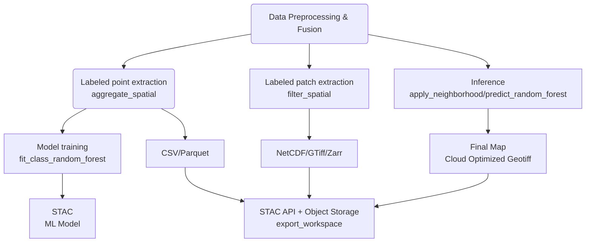

# Dynamic Land Cover Mapping

Mapping land cover is essential for monitoring environmental changes, managing natural resources and in many more decision-making processes. These maps are vital for analyzing changes in Earth's ecosystems and their structures (Congalton, Russell G., et al. "Global land cover mapping: A review and uncertainty analysis." Remote Sensing 6.12 (2014): 12070-12093.).

With growing interest in machine learning (ML) and deep learning (DL) methods, often user wonder on how to use openEO for various applications.The diagram below shows a few options for model training and inference and key involved openEO processes.

For training, we see 3 options:

1. Generate labeled point features and train random forest in openEO
2. Store labeled point features for offline training
3. Store labeled patch (raster) features for offline training

For inference, the 2 options are:

1. Use a random forest model trained in openEO
2. Use a UDF to apply your own ML model, using for instance ONNX

To streamline the process, openEO has implemented a Machine Learning capability using the Random Forest algorithm.Therefore, in this notebook Dynamic Land Cover Mapping, we show how users can use the output of the Random Forest model to monitor and analyze land cover changes over time. It furthermore includes a step-by-step guide for dynamic land cover mapping using the Random Forest model. Hence, notebook focuses on option (1) for training and option (1) for inference.

