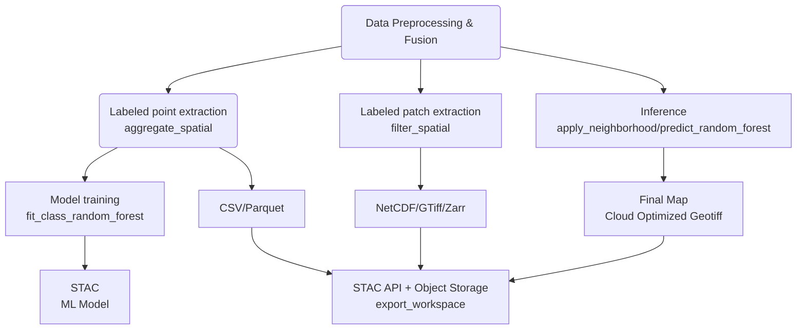

# Dynamic Land Cover Mapping

```mermaid
flowchart TD
    DATA_FUSION("Data Preprocessing &amp; Fusion") --> POINT_EXTRACT("Labeled point extraction<br>aggregate_spatial") & n1["Labeled patch extraction<br>filter_spatial"] & n2["Inference<br>apply_neighborhood/predict_random_forest"]
    POINT_EXTRACT --> n7["Model training<br>fit_class_random_forest"] & n3["CSV/Parquet"]
    n1 --> n4["NetCDF/GTiff/Zarr"]
    n2 --> n5["Final Map<br>Cloud Optimized Geotiff"]
    n3 --> n6["STAC API + Object Storage<br>export_workspace"]
    n4 --> n6
    n5 --> n6
    n7 --> n8["STAC<br>ML Model"]
```