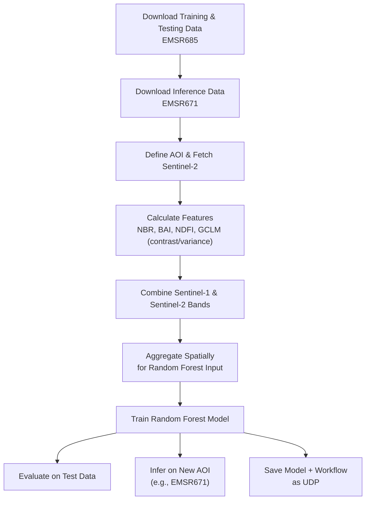

```mermaid
flowchart TD
    A1["Download Training & Testing Data<br>EMSR685"] --> A2["Download Inference Data<br>EMSR671"]
    A2 --> A3["Define AOI & Fetch Sentinel-2"]
    A3 --> A4["Calculate Features<br>NBR, BAI, NDFI, GCLM (contrast/variance)"]
    A4 --> A5["Combine Sentinel-1 & Sentinel-2 Bands"]
    A5 --> A6["Aggregate Spatially<br>for Random Forest Input"]
    A6 --> A7["Train Random Forest Model"]
    
    A7 --> B1["Evaluate on Test Data"]
    A7 --> B2["Infer on New AOI<br>(e.g., EMSR671)"]
    A7 --> B3["Save Model + Workflow<br>as UDP"]
```